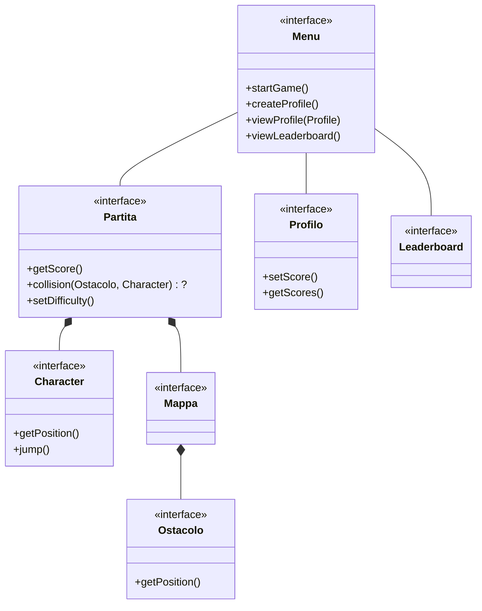

# Relazione Dragon Dash

## Abstract
Questo documento è una relazione di meta-livelo che descrive tutti i passaggi logici, concettuali e strutturali dell'applicativo da noi creato di nome "Dragon-Dash". 

# Analisi
Il gruppo si pone come obiettivo quello di realizzare un gioco single-player runner ad ostacoli in 2D chiamato “Dragon Dash”.
Il giocatore avrà la possibilità di controllare un personaggio, di gestirne le dinamiche di salto e di interazione con l’ambiente. 
Lo scopo del gioco sarà quello di evitare gli ostacoli nel percorso, tuttavia, nel caso in cui avvenga un contatto, la partita terminerà e l’utente visualizzerà il punteggio ottenuto.
All’avvio dell’applicativo viene data la possibilità di creare un profilo personale per ogni utente, e per ogni giocatore vengono raccolti i punteggi della partita che saranno classificati, insieme ai risultati di giocatori, in una leader-board.

### Requisiti Funzionali:
- Movimento del background:
- Generazione degli ostacoli: 
- Spostamento del character e collisioni con ambiente:
- Menu di navigazione e di pausa:

### Requisiti non Funzionali:
- L'applicativo permette di incrementare la difficoltà del gioco al progredire della durata della partita. 
- Gestione grafica
- Input sonori:
- Computo del punteggio e classificazione e visualizzazione:
- Creazione profilo personale:

# Analisi e modello del dominio:

Ad ogni avvio di partita il character controllato dall'utente verrà generato in una mappa contenente gli ostacoli che dovranno essere evitati. La partita avrà difficoltà crescente all'avanzare del tempo di gioco. Ad ogni avvio di applicazione il gioco sarà navigabile tramite un menu iniziale. Tramite quest'ultimo sarà possibile per l'utente creare un profilo personale, visionare i propri risultati di gioco e consultare la leader-board.

Movimento dello schermo

///////////////////////////

